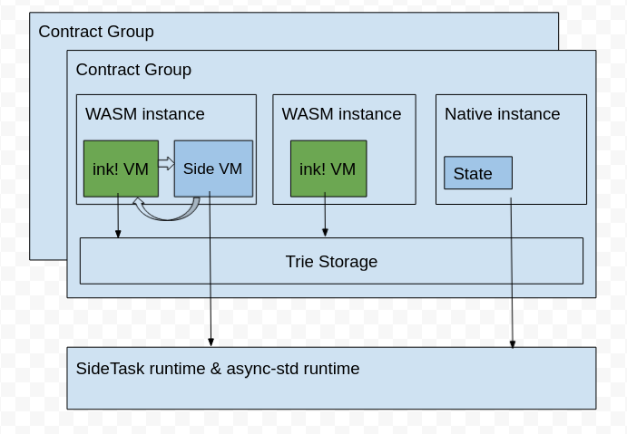
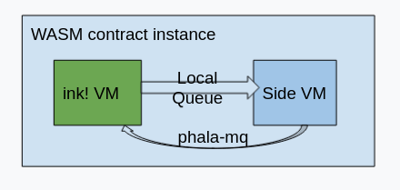
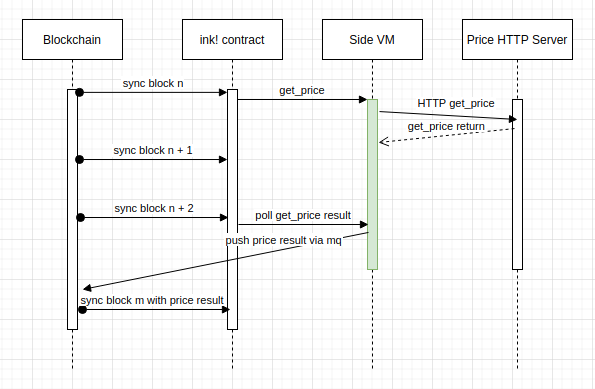

# pInk Side VM design
## Motivation
We want the pInk contract to have ability to access the internet. The `ink!` runtime does not allow the code to do such async tasks due to it's special execution model. The procedure of `ink!`'s message handling is: `Setup a new VM instance` -> `Call into wasm to handle a message` -> `Destroy the VM`. The wasm momery is dropped at each call completion. So async tasks can not live exceeding a single call. Thus we introduce a new VM instance called `Side VM` to achieve the functionality.

## Architecture overview



There are multiple contract groups supported inside one pRuntime instance. Each group can contain one trie storage and multiple contract instances which sharing the trie storage. One WASM contract instance have an `ink!` VM and optional an Side VM.

## What's inside the Side VM

The codes runing inside a Side VM is provided by the `ink!` contract which is compiled from the contract author defined source code. It should be initilized to idle and then waits for incoming commands from the `ink!` contract. When a command is received, it should start a async task to handle the command and emit phala-mq messages if needed.

## Side VM Initialization
Inside the WASM contract instance, the `ink!` contract code can optionally initiate a Side VM which is a isolated environment from the main `ink!` VM and is long-living in the background.

The Side VM can be initiated by calling the `pink_extension::init_side_vm` function at the contract instantiation time and can be initiated only once.

For example:

```Rust
#[ink::contract]
mod flip {
    use pink_extension as pink;

    #[ink(storage)]
    pub struct Flip {
        value: bool,
    }

    impl Flip {
        #[ink(constructor)]
        pub fn new() -> Self {
            let wasm_code = include_bytes!("wasm/sidetask.wasm");
            let memory_size = 1024*128;
            pink::initiate_side_vm(wasm_code, memory_size);
            Self::default()
        }
    }
}
```

## Communication between ink! and Side VM

When the ink! contract need to communicate with some other offchain component, it push a command to the Side VM via a local queue. The code in Side VM will handle the command and spawn a async task to talk to the offchain component. When the async task finishes, the Side VM can emit a phala-mq message to the ink! contract.




Pseduo code for pushing a command to the Side VM:

```Rust
#[ink::contract]
mod flip {
    use pink_extension as pink;

    #[ink(storage)]
    pub struct PriceBot {}

    #[derive(Encode, Decode)]
    pub struct Price {
        pair: String,
        price: u64,
    }

    impl PriceBot {
        #[ink(message)]
        pub fn foo() {
            let duration = 2; // 2 blocks to process the side task
            pink::push_side_command(duration, "get_price", "btc/usd");
        }

        #[ink(message)]
        pub fn get_price_result(price: Price) {
            do_something_with_price(price);
        }
    }
}
```

Pseduo code for the service in Side VM:

```Rust
#[pink::side_command]
// Optional default messages. If not specified, the default messages will
// be empty messages send to "phala/pink/blackhole"
#[pink(default_messages = "get_price_default_messages")]
async fn get_price(pair: String) -> Result<[Message； 1]> {
    let price = get_price_from_offchain(pair).await?;
    let price = Price {
        pair,
        price,
    };
    let selector = pink::calc_selector("get_price_result");
    let message = pink::build_ink_message(selector).push(price).build();
    let topic = pink::my_command_topic();
    [pink::prepare_message(message, topic)]
}

fn get_price_default_messages() -> [Message; 1] {
    [pink::prepare_message_to_blackhole()]
}
```

A happy path of a get_price sequence diagram:




## Unresolved problems

- [ ] What if OOM on allocating a new Side VM? pRuntime panic?
- [ ] How to cancel a CPU sensitive side task?
- [ ] Is there any security or safety issue in the Side VM?
- [ ] Is it OK that there are many contracts emits mq messages concurrently?